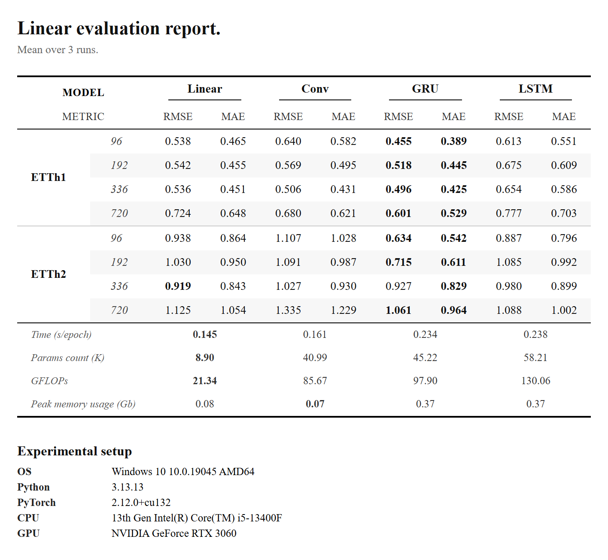

# ModelMark
With this tool you can measure the performance of your custom neural network model and compare it to other popular architectures.

Model evaluation report example:

Requirements:

	Python 3.11+

Usage:

	1) pip install -r requirements.txt
	2) Customize config.py and model/model.py 
	3) python modelmark.py
	4) Final report results will be in files "result.html" or "result.png" 
